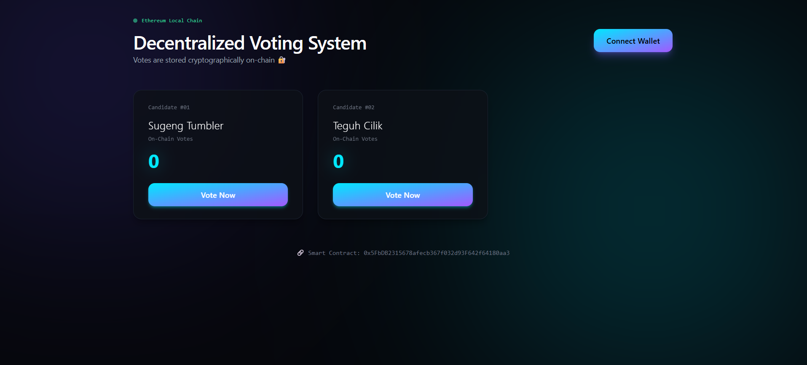

# Decentralized Voting DApp 🗳️


A full-stack decentralized voting application built on the **Ethereum Virtual Machine (EVM)**. This project demonstrates the implementation of a secure, immutable, and transparent election system using Smart Contracts (Solidity) and a modern React frontend.

> **Note:** This project is designed for local development and testing using the Hardhat Network.

---

## 📸 Application Preview



---

## 📖 Overview

In traditional voting systems, data integrity and trust are often centralized. This DApp solves that problem by leveraging blockchain technology.

### Key Capabilities
* **Immutability:** Once a vote is cast, it is permanently recorded on the blockchain and cannot be altered.
* **Transparency:** Anyone can verify the total vote count directly from the smart contract.
* **Security:** Prevents double-voting by tracking wallet addresses (`msg.sender`).
* **User Experience:** Seamless interaction via Metamask wallet with real-time feedback.

---

## 🛠️ Tech Stack

This project utilizes a modern Web3 development stack:

| Component | Technology | Description |
| :--- | :--- | :--- |
| **Blockchain** |  | Local development environment & compilation. |
| **Contract** |  | Smart Contract language (`^0.8.0`). |
| **Frontend** |  | User Interface (Vite). |
| **Styling** |  | Responsive styling. |
| **Integration** | **Ethers.js v6** | Library for interacting with the Ethereum Blockchain. |

---

## ⚙️ Installation & Setup Guide

Follow these steps to run the project locally on your machine.

### 1. Clone the Repository
```bash
git clone [https://github.com/ahmdhzq/voting-dapp.git](https://github.com/ahmdhzq/voting-dapp.git)
cd voting-dapp
```

### 2. Install Dependencies
You need to install dependencies for both the Hardhat backend and the React frontend.

**Root Directory (Backend):**
```bash
npm install
```

**Frontend Directory:**
```bash
cd frontend
npm install
cd ..
```

### 3. Start Local Blockchain
Open a **new terminal** and start the Hardhat node. This will generate 20 test accounts with fake ETH.
```bash
npx hardhat node
```
⚠️ **Keep this terminal running!** This is your local server.

### 4. Deploy Smart Contract
Open a **second terminal** and deploy the contract using Hardhat Ignition.
```bash
npx hardhat ignition deploy ./ignition/modules/Voting.js --network localhost
```
✅ **Action Required:** After deployment, copy the **Deployed Contract Address** (e.g., `0x5FbDB...`) from the terminal output.

### 5. Configure Frontend
Open `frontend/src/App.jsx` in your code editor. Locate the `CONTRACT_ADDRESS` variable and paste your address there:

```javascript
// frontend/src/App.jsx
const CONTRACT_ADDRESS = "YOUR_DEPLOYED_ADDRESS_HERE";
```

### 6. Run the Application
Start the frontend development server:
```bash
cd frontend
npm run dev
```
Open `http://localhost:5173` in your browser.

---

## 🦊 Metamask Configuration (Localhost)

To interact with the DApp, you must connect Metamask to your local Hardhat network.

1.  Open Metamask > Click Network Dropdown > **Add Network** > **Add a network manually**.
2.  Fill in the details:
    * **Network Name:** Hardhat Local
    * **RPC URL:** `http://127.0.0.1:8545/`
    * **Chain ID:** `31337`
    * **Currency Symbol:** ETH
3.  **Get Test ETH:**
    * Go to the terminal running `npx hardhat node`.
    * Copy one of the **Private Keys** (e.g., Account #0).
    * In Metamask: Click Account > **Import Account** > Paste Private Key.

---

## 🧠 Smart Contract Logic

The `Voting.sol` contract handles the core logic:

* `candidates`: A mapping struct to store candidate details.
* `voters`: A mapping to track addresses that have already voted (Anti-Double Voting).
* `vote()`: The main function that writes to the blockchain, increments the vote count, and emits an event.

```solidity
function vote(uint _candidateId) public {
    require(!voters[msg.sender], "You have already voted.");
    require(_candidateId > 0 && _candidateId <= candidatesCount, "Invalid candidate ID.");

    voters[msg.sender] = true;
    candidates[_candidateId].voteCount++;
    
    emit VotedEvent(_candidateId);
}
```

## 📄 License

This project is licensed under the MIT License. Feel free to use and modify it for your own portfolio or learning purposes.

---
Developed by **Ahmad Haziq**
